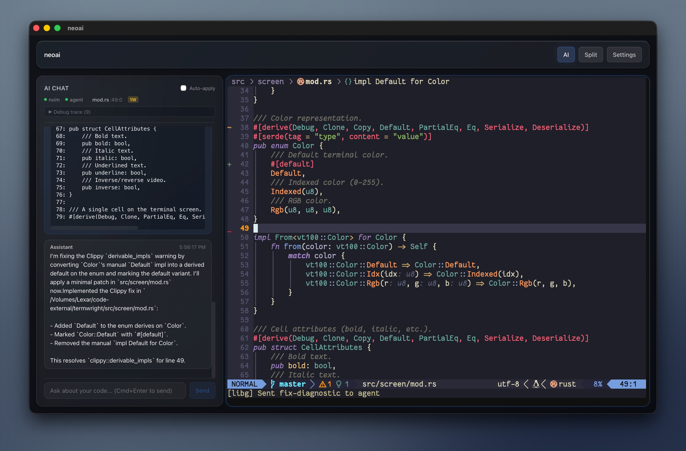

# NeoAI

Desktop coding workspace that combines:
- Embedded Ghostty terminal
- Neovim bridge and keymap injection
- ACP-compatible coding agent (`codex-acp`) with permission workflow



## What It Does

- Opens one terminal per selected project folder
- Connects to Neovim over a per-terminal socket
- Streams AI chat and tool-call events in-app
- Applies edits through the Neovim bridge (instead of direct filesystem writes)
- Auto-installs `codex-acp` when it is not found on `PATH`

## Requirements

- macOS
- Node.js + npm
- Rust toolchain
- `just` (recommended)
- Ghostty runtime libs in `.tools/libghostty` (or run `just setup-libghostty`)

## Quick Start

1. Install dependencies with `just install`.
2. Verify Rust/Tauri side with `just check`.
3. Run the app with `just dev`.

Optional debug run with MCP bridge:
- `just debug`

## ACP Agent Fallback

If `codex-acp` is missing, NeoAI downloads a managed release from `zed-industries/codex-acp`.

- macOS install root: `~/.neoai/agents/codex-acp/<version>/`
- Other platforms: app-local data dir under `agents/codex-acp/<version>/`

## Tmux Command Placement

NeoAI creates `<app-folder>/config.toml` on first launch to control tmux strategy for ACP command execution.

- macOS app folder: `~/.neoai`
- Other platforms: app-local data directory

Default runtime fallback is `window`, but the generated config starts with:

```toml
tmux_command_mode = "split"
allow_agent_tmux_override = true
agent_tmux_override_whitelist = ["split", "window", "hidden"]
```

The agent can request a mode using ACP request metadata key `_meta.neoai_tmux_mode`, and NeoAI applies it only if it matches the whitelist.

## Common Commands

- `just install`
- `just build`
- `just check`
- `just dev`
- `just debug`
- `just tauri-build`

## Project Layout

- `src/` React UI (chat, project explorer, terminal host)
- `src-tauri/src/ghostty_embed.rs` native Ghostty embedding
- `src-tauri/src/nvim_bridge.rs` Neovim RPC bridge
- `src-tauri/src/acp_client.rs` ACP client + vendor/install flow
- `src-tauri/src/socket_manager.rs` Neovim socket lifecycle
- `assets/screenshot.jpg` product screenshot used in this README
